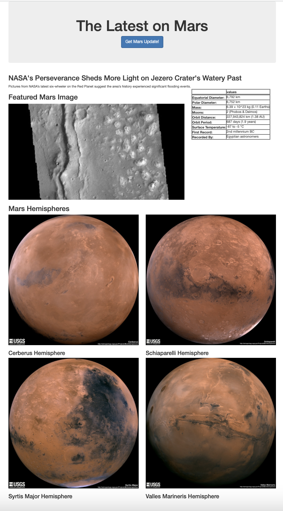

# All About Mars
## Summary
Flask app that web scrapes information on the planet Mars and returns the data on a webpage

## Tech Stack
__Languages__  
+ Python
+ HTML
+ Jinja

__Python dependencies__
+ pandas
+ requests
+ splinter
+ BeautifulSoup
+ ChromeDriverManager
+ Flask
+ PyMongo (flask_pymongo)

## Data Sources
+ [NASA Mars News Site](https://mars.nasa.gov/news/)
+ [JPL Mars Space Images](https://data-class-jpl-space.s3.amazonaws.com/JPL_Space/index.html)
+ [Space Facts](https://space-facts.com/mars/)
+ [USGS Astrogeology](https://astrogeology.usgs.gov/search/results?q=hemisphere+enhanced&k1=target&v1=Mars)

## Final Product
